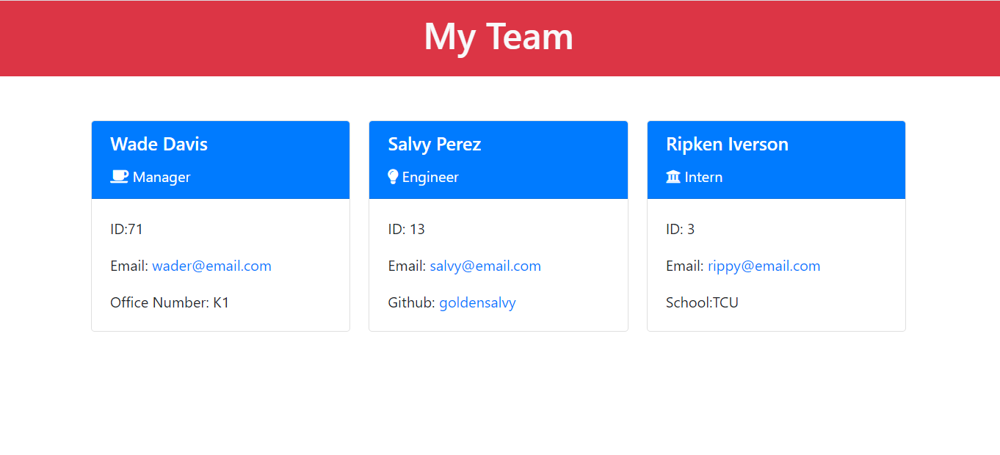
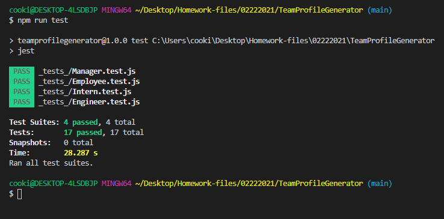

<h1 align ="center">Welcome to Team Profile Generator 👋</h1>
<p>
  
  <a href="https://github.com/kcnancy/TeamProfileGenerator#readme" target="_blank">
    
  </a>
  <a href="https://github.com/kcnancy/TeamProfileGenerator/graphs/commit-activity" target="_blank">
    
  </a>
  <a href="https://github.com/kcnancy/TeamProfileGenerator/blob/master/LICENSE" target="_blank">
  </a>
</p>


## Table of Contents
  - [Description](#description)
  - [Homepage](#homepage)
  - [Demos](#demo)
  - [Installation](#installation)
  - [Usage](#usage)
  - [Tests](#tests)
  - [Author](#author)
  - [Contributions](#contribution)
  - [License](#license)


### Description

```sh
> This project uses CLI input to create a Team Profile for an engineering team with interns. This project also uses jest for unit testing.
```

### 🏠 [Homepage](https://github.com/kcnancy/TeamProfileGenerator#readme)

### ✨ [Demo](https://drive.google.com/file/d/1f84U2IbyuA96pMEjTiGuoVr7dLzgpsuS/view)
### ✨  [Jest Demo](https://drive.google.com/file/d/1II_2YtY2JzbxYJ_NvEC5XZC8K1iUOD-f/view)

## Installation

```sh
npm install
```

## Usage

```sh
node app.js for the Team Profile Generator.
```


## Run tests

```sh
npm run test
```



## Author

👤 **Nancy McBride**

* Website: https://kcnancy.github.io/NancyMcBride-Portfolio/
* Github: [@kcnancy](https://github.com/kcnancy)

## 🤝 Contributing

Contributions, issues and feature requests are welcome!<br />Feel free to check [issues page](https://github.com/kcnancy/TeamProfileGenerator/issues). You can also take a look at the [contributing guide](https://github.com/kcnancy/TeamProfileGenerator/blob/master/CONTRIBUTING.md).


## 📝 License


This project is [MIT](https://github.com/kcnancy/TeamProfileGenerator/blob/master/LICENSE) licensed.

***
_This README was generated with ❤️ by [readme-md-generator](https://github.com/kefranabg/readme-md-generator)_